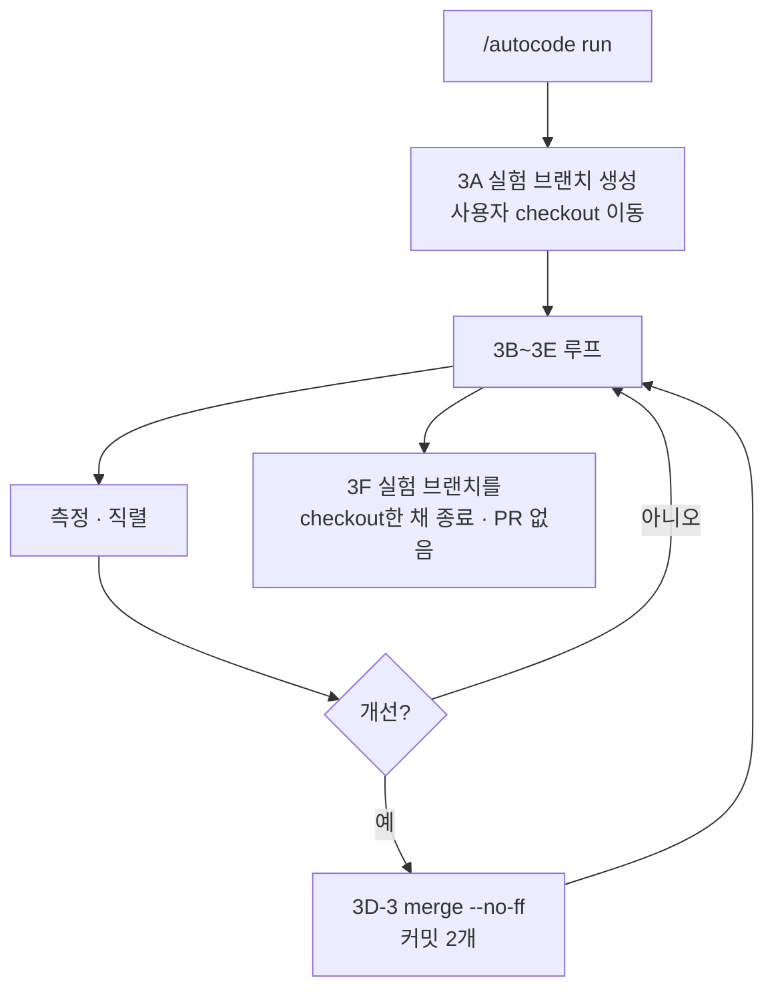
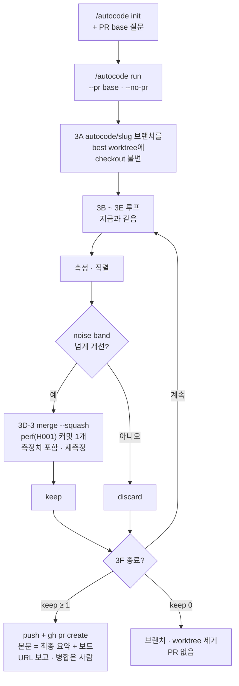

# 실험에서 PR로 — autocode가 채택한 개선만 모아 PR 하나로 끝낸다

- 날짜: 2026-09-04
- 대상: auto-loop 2.3.0 → 2.4.0 (weed-harness 3.2.0 → 3.3.0 릴리스)
- 설계 페이지: https://claude.ai/code/artifact/eed9c0a5-e00f-4010-a559-32a79d64bb14

## 큰 틀

autocode는 가설마다 git worktree를 만들어 병렬로 구현하고, 코디네이터가 직렬로 측정하고, noise band를 넘긴 것만 채택한다. 격리는 이미 되어 있다. 문제는 채택 이후다. 3A가 사용자의 checkout을 `autocode/{시각}` 실험 브랜치로 옮기고, 3D-3이 keep마다 `git merge --no-ff`로 experiment 커밋과 merge 커밋을 쌓고, 3F는 그 브랜치를 checkout한 채 PR 없이 끝난다. 커밋 메시지는 experimenter가 쓴 것이라 측정치가 없다. 이 설계는 루프의 안쪽(전략가 · 프론티어 · 측정 · keep 규칙 · 라우팅 · 보드)을 한 글자도 바꾸지 않고, 채택된 변경이 **어디에**(`.autocode/worktrees/best` worktree의 `autocode/<slug>` 브랜치, 사용자 checkout 불변), **어떤 모양으로**(keep마다 `merge --squash` 후 측정치를 본문에 담은 `perf(H{id}): …` 커밋 1개), **어떻게 끝나는지**(keep ≥ 1이면 push + `gh pr create`, base는 run을 시작한 브랜치, 본문은 최종 요약 + 보드 링크, URL만 보고하고 병합은 사람)를 바꾼다. init 인터뷰에 `pr_base` 질문 하나가 늘고 run에 `--pr <base>` / `--no-pr` 플래그가 는다. keep이 없으면 브랜치와 worktree를 지우고 PR 없이 끝난다. 원격이나 gh가 없으면 이유 한 줄과 사람이 칠 명령만 남기고 정상 종료한다. pr-babysit · CI 감시 · 병합은 붙이지 않는다.

## 목표

1. run 중에 사용자의 checkout이 바뀌지 않는다. 실험 브랜치는 best worktree에만 산다.
2. 실험 브랜치의 커밋 하나가 채택된 개선 하나이고, 메시지에 측정치가 있다.
3. 종료 시 keep ≥ 1이면 PR이 열리고 URL이 요약 · status · 보드에 보인다.
4. 원격 · gh · keep이 없어도 루프는 정상 종료한다.
5. `--no-pr` 또는 인터뷰의 `none`으로 PR을 끌 수 있다.

## 비목표

- 전략가 · 프론티어 · 측정 · noise band · keep 규칙 · 라우팅 · 보드 데이터 규칙은 그대로다.
- experimenter의 `experiment(H{id})` 커밋과 result.json은 그대로다. squash의 재료일 뿐이다.
- PR을 병합하지 않는다. pr-babysit · CI 감시 · 충돌 해결을 붙이지 않는다.
- keep마다 push해서 PR을 살아 있는 창으로 쓰지 않는다. 창은 보드다.
- design-map spec 형식은 바꾸지 않는다. PR base는 autocode 인터뷰의 질문이다.

## 현재 구조



## 확정 구조



### 채택 커밋의 형태

```
perf(H001): memoize the compiled validator

metric   p95_latency_ms 182.4 -> 147.3 (-19.2%)
noise    ±2.1   route experimenter-fast (haiku/low)
claim    per-request schema compile dominates p95
board    <link or path>
```

### 종료 시 git 모양 (keep 2건)

```
$ git branch --show-current            # 사용자 checkout: 그대로
feat/tinycalc-median
$ git log --oneline autocode/tinycalc-median
9e8f7a6 perf(H004): drop the redundant sort
5b6c7d8 perf(H001): memoize the compiled validator
a1b2c3d <base>
```

## 결정

| id | 질문 | 선택 | 이유 |
|---|---|---|---|
| D1 | 사용자 checkout | 실험 브랜치를 `.autocode/worktrees/best` worktree에 두고 checkout은 건드리지 않는다 | 루프가 도는 동안 사용자는 자기 브랜치에서 계속 일한다. 가설 worktree가 이미 그 그림이다 |
| D2 | 채택 커밋의 형태 | keep마다 `merge --squash` 후 측정치를 담은 커밋 1개 | PR 커밋 하나 = 개선 하나. revert 단위가 개선 단위. interaction 롤백은 스테이징된 squash를 `reset --hard`로 버리는 것 |
| D3 | PR을 여는 조건 | keep ≥ 1 이고 `pr_base ≠ none`이면 3F에서 연다 (기본 켜짐) | 채택된 것을 모아 PR로 올리는 것이 정상 종료 형태. 끄려면 `--no-pr` 또는 인터뷰에서 none |
| D4 | PR base | run을 시작한 브랜치가 기본. init 인터뷰에서 확인, `run --pr <base>`로 덮어쓰기 | 실험 브랜치는 시작 브랜치에서 갈라지므로 돌아가는 곳도 거기다. design-map이 만든 feat 브랜치면 PR은 그 feat 브랜치로 |
| D5 | PR을 여는 시점 | 3F 종료 시 한 번 | interaction 롤백이 push한 커밋을 지우면 force push가 필요해진다(금지). 루프 중의 창은 보드 |
| D6 | PR 제목과 본문 | 제목 `perf: <metric> <baseline> → <best> (−x%)`, 본문 = 최종 요약 + 보드 링크 | 요약은 이미 3F가 만든다. 리뷰어가 보드 없이도 무엇이 왜 채택됐는지 안다 |
| D7 | 실험 브랜치 이름 | `autocode/<slug>` (spec slug → metric_name 순, 충돌 시 `-2`) | PR 브랜치는 사람이 읽는 이름. 시각은 state.json과 보드에 있다 |
| D8 | keep이 없을 때 | best worktree와 브랜치 제거, PR 없음, 요약에 채택 없음 | 모을 것이 없다. 반박된 가설은 lessons와 보드에 남는다 |
| D9 | PR 이후 | URL을 보고하고 끝. 병합은 사람 | 지표를 움직인 코드는 사람이 읽고 병합한다. babysit는 티켓 조건을 전제한다 |
| D10 | 원격이나 gh가 없을 때 | 이유 한 줄 + 브랜치 이름 + `gh pr create` 명령을 남기고 정상 종료 | 원격 없는 토이 레포에서도 루프는 정상 종료. PR은 조건부 산출물 |
| D11 | 보드와 상태 | state.json `pr_base` · `pr_url`, 보드 `run.pr`, status 블록에 한 줄 | 종료 후 사용자가 보는 것은 보드다 |
| D12 | 버전 | auto-loop 2.4.0, 릴리스 v3.3.0 | program.md · state.json · 보드 데이터는 호환. 릴리스 노트 첫 줄은 "checkout을 더 이상 옮기지 않는다" |
| D13 | 커밋 접두어 | `perf(H{id})` 고정 | autocode는 지표 하나를 움직이는 루프다. direction이 higher인 지표도 성능의 한 종류로 본다 |

## 구현 순서

1. autocode SKILL.md 3A — `autocode/<slug>` 브랜치를 `.autocode/worktrees/best` worktree에 만들고 checkout은 건드리지 않는다. Step 1에 `--pr <base>` · `--no-pr`. pre-flight 출력에 PR base. — 확인: SKILL.md에 checkout을 옮기는 문장이 없고 3A에 `worktree add … best` 명령이 있다.
2. 3D-3 — best worktree 안에서 `merge --squash` → 재측정 → `perf(H{id})` 커밋(측정치 본문) 또는 `reset --hard`(interaction · conflict · 측정 실패 모두 스테이징된 squash만 버린다). — 확인: 3D-3 의사코드에 `--no-ff`가 없고 `--squash`와 커밋 메시지 형식이 있다.
3. 3F — keep ≥ 1 이고 pr_base ≠ none이면 push + `gh pr create`, 원격/gh 없으면 이유 + 명령 출력, keep 0이면 정리. state.json `pr_url`. Step 4 · 5도 맞춘다. — 확인: 3F에 `gh pr create`와 세 갈래(열림 · 생략 이유 · keep 0)가 모두 있다.
4. reference.md — 인터뷰 필드 `pr_base`, program.md Budget에 `pr_base`, state.json에 `pr_base` · `pr_url`, 최종 요약과 status 블록에 PR 줄, 보드 데이터 `run.pr`, 파일 구조에 `worktrees/best`. — 확인: 예시들이 모두 새 필드를 보인다.
5. view.html — `run.pr`이 있으면 metric strip에 PR 타일 하나(링크). validate.py는 `run.pr`을 선택 키로 받는다. — 확인: run.pr 있는 픽스처와 없는 픽스처 둘 다 render.py 통과, 있는 쪽 페이지에 링크.
6. 문서 · 버전 — README · SKILL_MAP · skills-hooks-reference의 autocode 행, auto-loop 2.4.0 + 마켓플레이스, weed-harness 3.3.0. — 확인: `npm test` 통과.
7. vn 검증 — 토이 레포에서 init(pr_base 질문) → run --parallel 2, 예산 4. 원격 없는 경로와 로컬 bare 원격을 붙인 push 경로를 확인. — 확인: 사용자 checkout 브랜치가 run 전후 같다; `autocode/<slug>`에 keep 수만큼의 perf 커밋만 있다; 요약에 PR 생략 이유 한 줄.
8. 릴리스 · 배포 — v3.3.0, vn · home_pc · 노트북 · data_converter. — 확인: 각 머신 auto-loop 2.4.0, autocode description에 `--pr` 문구.
