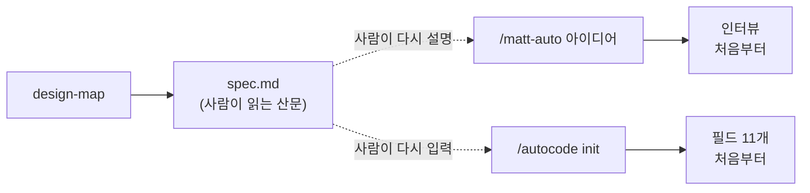
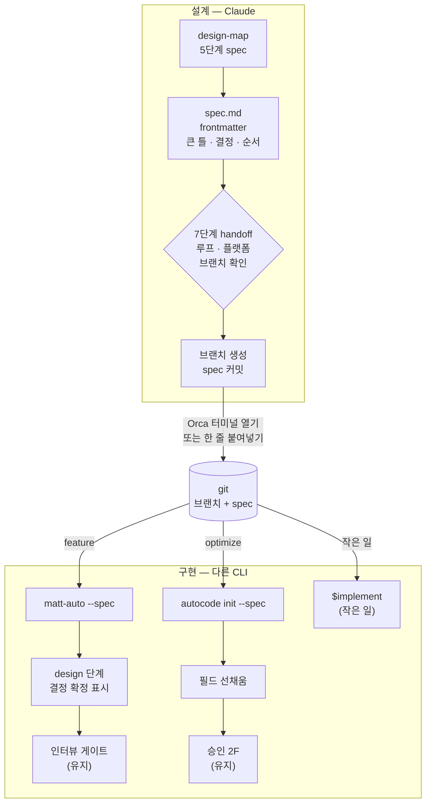

# 설계에서 루프로 — design-map spec을 matt-auto · autocode가 이어받는다

- 날짜: 2026-09-04
- 대상: weed-harness 3.1.0 → 3.2.0 (matt-loop 1.14.0, auto-loop 2.3.0)
- 설계 페이지: https://claude.ai/code/artifact/73973bb7-d071-4d19-b79d-b886e6e1c4e9

## 큰 틀

design-map(Claude 전용)은 다이어그램으로 설계를 확정하고 `docs/design/<topic>.md`에 spec을 남긴 뒤 멈춘다. 구현 루프인 matt-auto(기능)와 autocode(지표 최적화)는 그 파일을 모른 채 처음부터 다시 묻는다. matt-auto는 인터뷰에서 이미 확정된 결정을 재질문하고, autocode init은 11개 필드를 전부 다시 받는다. 설계는 Claude에서 하고 구현은 토큰 분배 때문에 Codex나 OpenCode에 맡기는 것이 기본이므로, 두 세션 사이를 건너는 것은 파일뿐이다. 따라서 spec 파일이 (1) 루프가 기계적으로 읽을 frontmatter, (2) 설계 대화 없이도 위임자가 이해할 "큰 틀" 절, (3) 결정 표와 구현 순서를 갖춘 자족적인 다리가 되어야 한다. design-map은 handoff에서 루프·플랫폼·브랜치(기준 브랜치와 이름)를 한 번 확인하고, 브랜치를 만들어 spec 파일 하나만 커밋한 뒤, Orca가 닿으면 구현 CLI 터미널을 열어 그 플랫폼의 handoff 한 줄을 보내고, 아니면 붙여넣을 한 줄을 보여주고 끝난다. design-map은 matt-auto를 직접 호출할 수 없다(`disable-model-invocation`). 사용자가 입력하는 슬래시 명령이 유일한 진입이고 플랫폼마다 문법이 다르므로 handoff 줄은 플랫폼별로 낸다. matt-auto `--spec`은 결정 그래프에 읽기 전용 `design` 단계를 먼저 만들고 열린 질문만 인터뷰하되 인터뷰 게이트는 유지한다. autocode `init --spec`은 frontmatter의 metric 블록으로 필드를 선채우되 후속 질문과 승인(2F)은 유지한다. 새 스크립트는 없다. 다리는 템플릿 계약이다.

## 목표

1. design-map이 쓰는 spec에 고정 frontmatter와 고정 헤딩(큰 틀 · 목표 · 비목표 · 확정 구조 · 결정 · 구현 순서)을 둔다.
2. design-map 7단계 handoff가 루프·플랫폼·브랜치를 한 라운드로 확인하고, 브랜치 생성 → spec 단독 커밋 → Orca 터미널 또는 한 줄 제시로 끝난다.
3. `matt-auto --spec <path>`: spec 결정은 확정으로 들어가고, 인터뷰는 spec이 답하지 않은 질문만 묻는다. 게이트는 그대로.
4. `autocode init --spec <path>`: metric 블록으로 필드를 선채우고 빈 것만 묻는다. 후속 질문과 승인은 그대로.
5. `--spec` 없이 호출하면 두 루프 모두 지금과 똑같이 동작한다.

## 비목표

- 루프 그래프(인터뷰 게이트, 결정 위임자, 승인 2F, 가설 프론티어)는 건드리지 않는다.
- design-map은 Claude 전용으로 남는다. 다른 플랫폼은 git의 spec 파일과 handoff 한 줄만 받는다.
- design-map은 구현 CLI를 감시하거나 결과를 받아오지 않는다. 넘긴 뒤의 창은 루프의 loop-report 페이지다.
- to-spec · to-tickets · grill-with-docs · implement 등 벤더 스킬은 수정하지 않는다. 입력(맥락)만 달라진다.
- spec 파일을 이슈 트래커나 PR로 올리지 않는다. 파서 스크립트(spec.py)는 만들지 않는다(D1).

## 현재 구조



## 확정 구조



### spec 템플릿 (design-map 5단계가 쓴다)

```markdown
---
design-map: 1
slug: <topic>
kind: feature            # feature | optimize
loop: matt-auto          # matt-auto | autocode | implement
followup: autocode       # optional: a second loop to run after `loop` finishes
status: confirmed        # draft | confirmed
artifact: https://claude.ai/code/artifact/…
branch: <branch name>    # confirmed at handoff
handoff:                 # one line per platform; design-map prints the chosen one
  codex: "use $matt-auto --spec docs/design/<topic>.md"
  opencode: "/matt-auto --spec docs/design/<topic>.md"
  claude: "/matt-loop:matt-auto --spec docs/design/<topic>.md"
metric:                  # required when loop or followup is autocode; allowed otherwise
  name: <metric_name>
  command: <prints one number on the last line>
  direction: lower       # lower | higher
  target: null
  target_files: [<paths>]
  guard: <test command>
  forbidden: [<paths>]
---
# 제목
## 큰 틀        (위임자 브리핑: 대화 없이 읽어도 충분한 5~10문장)
## 목표 / ## 비목표
## 확정 구조   (mermaid)
## 결정        (표: id · 질문 · 선택 · 이유)
## 구현 순서   (번호 목록: 단계 + 확인)
```

- frontmatter는 루프가 보는 부분, 본문은 사람과 루프가 같이 읽는 부분이다.
- `status: draft`인 spec을 `--spec`으로 받으면 matt-auto와 autocode는 `spec not confirmed: run /design-map first`를 출력하고 멈춘다. implement 경로에는 게이트가 없다(아래).
- `kind: feature`이면 `loop: matt-auto`, `kind: optimize`이면 `loop: autocode`, 한 파일 30분 이하이면 `loop: implement`. design-map이 분류하고 handoff 질문에서 사용자가 바꿀 수 있다. 구조도 바꾸고 숫자도 움직이는 설계는 `loop: matt-auto` + `followup: autocode`이고 metric 블록을 함께 쓴다(D12).
- `metric` 블록은 `kind`가 아니라 `loop`/`followup`에 묶인다. autocode가 어느 순서로든 이 파일을 읽으면 선채움이 된다.
- **handoff 줄은 플랫폼마다 다르다(D14).** Codex는 `use $<skill> …`, OpenCode는 설치기가 만드는 슬래시 명령 `/<skill> …`, Claude Code는 `/matt-loop:<skill> …`(플러그인 네임스페이스). matt-auto와 implement는 `disable-model-invocation: true`이므로 어느 플랫폼에서도 사용자가 입력해야 한다. design-map이 스킬을 대신 호출하는 일은 없다.
- `loop: implement`의 handoff 줄은 `use $implement on docs/design/<topic>.md` (플랫폼별 문법 동일 규칙). `--spec` 플래그도, status 게이트도, 보고 페이지도 없다. 벤더 스킬 그대로이며 spec의 구현 순서가 작업 목록이다.

### design-map 7단계 handoff (확정 동작)

1. **분류** — 본문에서 kind와 loop(필요하면 followup)를 정한다. `git branch --show-current`, `git remote -v`, `git status --porcelain`을 읽는다. 설치된 루프를 확인한다. Claude Code 플랫폼 선택지는 이 세션에 해당 루프 스킬이 보일 때만 낸다(노트북과 vn Claude에는 matt-loop가 없다).
2. **확인 한 라운드** — AskUserQuestion 하나로 (a) 루프(추천값 선택), (b) 구현 플랫폼: Codex(추천) / OpenCode / Claude Code(설치된 경우만) / 명령만 받기, (c) 기준 브랜치(추천: 현재 브랜치가 main·dev면 그것, 아니면 main), (d) 새 브랜치 이름(추천 `feat/<slug>`, 또는 기준 브랜치에 그대로)을 받는다.
3. **커밋** — spec 외에 추적 중인 변경이 있으면(`git status --porcelain`에서 spec 경로를 뺀 나머지) 브랜치를 바꾸지 않고 한 번 더 묻는다(현재 브랜치에 커밋 / 중단). 깨끗하면 `git checkout -b <name> <base>`(같은 브랜치면 생략) 뒤 `git add <spec> && git commit -o <spec> -m "docs(design): add <slug> spec"`. `-o`가 spec 한 파일만 커밋한다. 체크아웃은 그 브랜치에 둔 채로 끝난다. 터미널은 이 체크아웃에서 열리므로 브랜치 전환이 곧 handoff 준비다.
4. **넘기기** — 플랫폼이 Codex/OpenCode이면 `deliver.py probe`의 답에서 `bin`을 읽는다(loop-report의 규칙 그대로: Orca 터미널 안이거나 Linux가 아닐 때만 `orca`를 시도, 그 밖에는 `orca-ide`만. 바깥 Linux의 `orca`는 GNOME 화면 낭독기다). `bin`이 null이면 Orca 없음 → 한 줄 제시. 있으면 `<bin> terminal create --worktree path:<repo> --command <codex|opencode> --json`; `selector_not_found`이면 `<bin> repo add --path <repo> --json` 뒤 한 번 재시도; 그래도 실패면 한 줄 제시로 내려간다. 터미널이 열리면 `terminal read --screen`을 폴링해 CLI 프롬프트(Codex `› Ask Codex`, OpenCode의 입력 프롬프트)가 보일 때까지 기다린 뒤(최대 60초, 넘기면 한 줄 제시) handoff 줄을 보내고 Enter, 다시 폴링해 작업 표시(`Working (`)가 나타나는 것까지만 확인한다. Claude Code이면 그 플랫폼의 줄을 보여주고 사용자가 입력한다. "명령만 받기"이면 선택한 플랫폼의 줄을 보여준다.
5. **끝** — spec 경로, Artifact 링크, 브랜치(기준 → 이름), 넘긴 곳(터미널 id 또는 "붙여넣기")과 handoff 줄을 보고하고 멈춘다. 감시하지 않는다. 진행 창은 루프의 loop-report 페이지다.

### matt-auto `--spec <path>` (확정 동작)

- **1 Precondition** — spec을 읽는다. frontmatter `status`가 `confirmed`가 아니면 `spec not confirmed: run /design-map first`를 출력하고 멈춘다. 결정 로그 첫 줄에 `spec: <path>`, 두 번째 줄에 `artifact: <url>`.
- **3 Delegate** — 위임자 브리핑의 "큰 틀 요약"은 spec의 `## 큰 틀` 절을 그대로 쓴다. 위임자는 spec의 결정 표를 권위로 답한다.
- **4 Interview** — `$interview-report` 데이터에 `design` 단계를 맨 앞에 넣는다: `id: "design"`, `name: "설계 (design-map)"`, `status: "done"`, `note: <artifact url>`; 결정마다 `id`는 spec의 D-id 그대로, `question`/`decision`/`rationale`는 표의 질문/선택/이유, `source: "design-map"`, `before: null`, `change: "new"`(표에 이전 상태가 적혀 있으면 그것과 `keep`/`redirect`). 페이지는 `source: "design-map"` 노드를 **읽기 전용**으로 그린다(편집 칸·문제 표시 없음, "설계에서 확정" 배지). 따라서 `<slug>.edits.json`에 design 노드는 들어올 수 없다. grill-with-docs는 지금처럼 호출하되 위임자에게 "spec이 이미 답한 질문은 해당 D-id를 인용해 닫고, 답하지 않은 질문만 결정하라"고 브리핑한다. 확정 결정을 뒤집어야 하는 질문은 위임자가 `ESCALATE: contradicts <D-id>`로 올린다. 사용자가 게이트에서 채팅으로 설계 결정을 바꾸면 그것은 인터뷰 단계의 새 결정(`change: "redirect"`, `before`에 D-id의 선택)이 되고 로그에 `design override <D-id>`로 남는다. spec 파일은 고치지 않는다. 인터뷰 게이트는 그대로 선다.
- **5 Size branch** — spec의 구현 순서 단계 수를 근거로 쓴다(1~2단계 → 작은 경로 후보).
- **6 · 7** — to-spec · to-tickets는 그대로 호출하되 spec 파일을 맥락으로 준다. 구현 순서의 각 단계와 확인 방법은 티켓과 게이트의 씨앗이다.
- **결정 로그 끝** — `spec_questions_reasked: <n>` (spec 결정과 겹쳤던 인터뷰 질문 수; 목표 0).
- **Red flag 추가** — spec이 이미 답한 결정을 위임자나 사용자에게 다시 묻는다 → design 단계는 확정이다. 뒤집으려면 ESCALATE.

### autocode `init --spec <path>` (확정 동작)

- **2A** — 정찰은 그대로. spec의 `## 큰 틀`과 `## 확정 구조`를 함께 읽는다.
- **2B** — frontmatter `metric` 블록으로 `metric_name` · `metric_command` · `metric_direction` · `performance_target` · `target_files` · `guard_command` · `forbidden_zones`를 채운다. 비어 있거나 없는 필드만 본질문을 한다(`worktree_setup`, `scope`, `max_experiments`, `parallel`은 보통 질문으로 남는다). **선채운 값도 답으로 취급하므로 답에 매인 후속 질문은 그대로 나간다**(디렉터리 target → 핫패스 파일, module 이상 → 인터페이스 호환, guard가 테스트뿐 → typecheck/lint, metric 60초 초과 → screen_command). `status`가 `confirmed`가 아니면 거부한다(matt-auto와 같은 문구).
- **2C** — 난이도 분류에 spec의 확정 구조 범위를 근거로 쓴다.
- **2D** — Strategy Hints에 `## 큰 틀`과 `## 결정` 표를 넣고, `spec: <path>` 한 줄을 program.md 맨 위에 적는다.
- **2F** — 승인은 그대로 받는다.

## 결정

| id | 질문 | 선택 | 이유 |
|---|---|---|---|
| D1 | 다리의 형태 | A 템플릿 계약 (frontmatter + 고정 헤딩) | spec 읽기는 명령 조합이 아니라 독해다. 코드 0줄로 시작하고, 형식이 자주 깨지면 그때 파서 스크립트(B). |
| D2 | 루프 선택 방식 | design-map이 kind로 자동 분류 후 확인 한 번 | 숫자를 움직이면 optimize→autocode, 구조를 바꾸는 여러 단계면 feature→matt-auto, 한 파일 30분이면 implement. 확인은 AskUserQuestion 한 라운드. |
| D3 | matt-auto --spec에서 인터뷰 | 열린 질문만, 게이트 유지 | spec이 답하지 못한 구현 수준 질문은 남는다. 게이트는 사용자가 보는 유일한 한 번. 확정 결정을 뒤집는 질문은 ESCALATE. |
| D4 | autocode init --spec에서 승인 | 선채움 + 후속 질문 + 승인 유지 | metric_command는 실제로 실행되는 명령이다. 사람이 한 번 보고 승인한다. 후속 질문이 immutable_constraints · interface_compat · screen_command를 채우므로 건너뛰지 않는다. |
| D5 | 구현은 어디서 도나 | handoff에서 플랫폼을 묻는다, 기본 추천 Codex | 설계는 Claude, 구현은 다른 CLI가 기본(토큰 분배). Claude Code는 루프가 설치된 세션에서만 선택지에 오르고, 그때도 사용자가 슬래시 명령을 입력한다. |
| D6 | 브랜치와 spec 커밋 | 기준 브랜치와 이름을 묻고, spec 한 파일만 `git commit -o`로 커밋한 뒤 넘긴다 | 다른 CLI · worktree · 원격 워커가 같은 파일을 보려면 git에 있어야 한다. CLAUDE.md 규칙대로 기준 브랜치와 이름을 함께 받는다. 추적 중인 다른 변경이 있으면 브랜치를 바꾸지 않고 묻는다. autocode는 그 위에 자기 브랜치를 만든다. |
| D7 | 결정 그래프 페이지 | design 단계를 맨 앞에 추가, 읽기 전용 노드에 "설계에서 확정" 배지 | 설계에서 온 것과 인터뷰에서 새로 결정된 것이 한눈에 갈라져야 한다. 읽기 전용이라 edits.json에 되돌릴 수 없는 단계가 들어오지 않는다. 설계 결정 변경은 채팅으로, 인터뷰 단계의 redirect 결정으로 기록한다. |
| D8 | 버전 | weed-harness 3.2.0 · matt-loop 1.14.0 · auto-loop 2.3.0 | --spec 없이는 지금과 같다. 새 플래그와 새 단계뿐. |
| D9 | matt-auto 문서 크기 | ≤ 4,800 단어 | 지금 4,595. --spec 절은 200단어 안. |
| D10 | spec의 자족성 | `## 큰 틀` 절 필수 | 받는 세션은 설계 대화를 모른다. 위임자 브리핑과 Strategy Hints가 여기서 나온다. |
| D11 | 넘기는 수단 | Orca 터미널 자동 + 한 줄 폴백 | vn에서 검증된 경로를 전제까지 그대로 쓴다: bin은 deliver.py probe에서, repo 미등록은 repo add 후 재시도, TUI 프롬프트가 뜬 뒤 전송, `Working (`까지만 확인. 어느 단계든 실패하면 한 줄 제시. 연 뒤 design-map은 끝난다. |
| D12 | feature와 optimize가 겹치는 설계 | `loop: matt-auto` + `followup: autocode`, metric 블록 동봉 | 구조가 먼저 자리잡아야 지표 실험이 의미 있다. metric 블록은 kind가 아니라 loop/followup에 묶여 후속 autocode가 같은 파일로 선채움된다. |
| D13 | Orca 터미널의 모델·effort | 지정하지 않는다 | 사용자의 Codex/OpenCode 기본값을 쓴다. 라우팅은 루프 안의 `$model-routing`이 한다. |
| D14 | handoff 줄의 문법 | 플랫폼별 세 줄을 frontmatter에 두고 선택한 것을 낸다 | Codex `use $skill`, OpenCode `/skill`, Claude Code `/matt-loop:skill`. matt-auto · implement는 `disable-model-invocation`이라 모델이 호출할 수 없고 사용자가 입력한다. |
| D15 | `loop: implement`의 handoff | 플래그 · 게이트 · 페이지 없이 `use $implement on <spec>` | 벤더 스킬은 고치지 않는다. 작은 일에 보고 페이지는 과하다. spec의 구현 순서가 작업 목록이다. |

## 구현 순서

1. **design-map SKILL.md** — 5단계 spec 템플릿(frontmatter + `## 큰 틀`)과 7단계 handoff(분류 → 확인 한 라운드(루프 · 플랫폼 · 기준 브랜치 · 이름) → `git commit -o` 단독 커밋 → `deliver.py probe`로 bin → 터미널(repo add 재시도, 프롬프트 대기, 전송) 또는 한 줄).
   확인: 이 spec 파일의 frontmatter가 템플릿과 같다. 스킬 텍스트에 handoff 다섯 동작과 세 플랫폼 문법이 있다. `docs/design/design-handoff.md`가 `feat/design-handoff`에 단독 커밋(`git show --stat HEAD`가 파일 1개)으로 있다.
2. **matt-auto SKILL.md** — `--spec` 플래그: description, 1 · 3 · 4 · 5 단계, design override 규칙, 결정 로그 끝의 `spec_questions_reasked`, red flag 1개.
   확인: `wc -w` ≤ 4,800. `--spec` 없는 경로의 문장은 바뀌지 않았다(diff가 추가 위주).
3. **interview-report** — SKILL.md의 stage 목록에 `design` 단계(id `design`, 결정 id는 spec의 D-id, `source: "design-map"`)를 추가하고, `view.html`이 `source: "design-map"` 노드를 읽기 전용(편집 칸 · 문제 체크박스 없음)으로 그리며 "설계에서 확정" 배지를 붙이고 exportPayload에서 제외한다. validate.py는 `source`가 있는 결정에 `change`가 없으면 에러를 낸다(퇴화 렌더 방지).
   확인: design 단계가 든 픽스처로 `render.py`가 통과하고 페이지 텍스트에 "설계에서 확정"이 있으며 그 노드에 textarea가 없다. 기존 데이터(vn `tinycalc-count.data.json`)도 여전히 통과한다.
4. **autocode SKILL.md + reference.md** — `init --spec`: 2A · 2B 선채움과 후속 질문 유지 · 2C · 2D(`spec:` 줄, Strategy Hints) · 2F 유지. reference.md § Interview fields에 "spec에서 채워지는 키" 열 추가.
   확인: SKILL.md 줄 수 ≤ 440. `--spec` 없는 init 절은 그대로다.
5. **문서 · 버전 · 버전 검사** — README, docs/SKILL_MAP.md, docs/skills-hooks-reference.html, 마켓플레이스 두 곳과 plugin.json 여섯 곳(3.2.0 / 1.14.0 / 2.3.0). `bin/check-versions.mjs`를 추가해 `.claude-plugin/plugin.json` · `.codex-plugin/plugin.json` · `plugins/*/.claude-plugin/plugin.json` · `plugins/*/.codex-plugin/plugin.json` · `.claude-plugin/marketplace.json` · `.agents/plugins/marketplace.json`의 플러그인별 버전이 일치하는지 검사하고 `npm test`와 CI에 넣는다.
   확인: 한 파일만 올리면 `npm test`가 실패하고, 전부 맞추면 통과한다.
6. **플랫폼 간 검증(vn)** — vn Claude에서 design-map으로 토이 spec(tinycalc `--median`)을 쓰고 Orca 터미널로 Codex `matt-auto --spec`에 넘긴다. autocode는 `init --spec`으로 program.md만 만든다.
   확인: Codex 세션이 spec을 읽고 design 단계가 있는 게이트 페이지를 띄운다. 결정 로그의 `spec_questions_reasked: 0`. program.md의 Metric · Guard · Target이 frontmatter와 같고 후속 질문이 한 번 이상 나왔다.
7. **릴리스 · 배포** — v3.2.0 태그, vn · home_pc · 노트북 · data_converter.
   확인: 각 머신에서 weed-harness 3.2.0, Codex 쪽 matt-auto description에 `--spec` 문구가 보인다. 노트북과 vn Claude에는 matt-loop를 설치하지 않는다.
