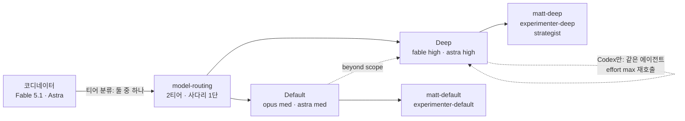

# 하네스 다이어트 B — 모델이 세져서 근거를 잃은 구조를 걷어낸다

- 날짜: 2026-09-06
- 대상: weed-harness 3.3.0 → 4.0.0, matt-loop 1.14.0 → 2.0.0, auto-loop 2.4.0 → 3.0.0
- 선행: `feat/model-routing-astra` (A — 라우팅 표를 gpt-6-astra · Fable 5.1 세대로, 커밋 `a02ffab`). 이 spec은 그 위에서 시작한다.
- 설계 페이지: https://claude.ai/code/artifact/23ec4829-6324-46f0-95d2-7fce8ab9a89a

## 큰 틀

모델이 Astra와 Fable 5.1로 올라간 뒤 하네스의 네 곳이 근거를 잃었다. (1) 라우팅은 모델 축이 사라져 effort 축만 남았으니 티어를 Default/Deep 둘로 줄인다. Fast였던 일은 Default로 가고(Codex에서는 같은 모델의 medium), Max는 Codex에서 같은 에이전트를 `reasoning_effort: "max"`로 다시 부르는 재시도 한 단으로 바뀐다. Claude Code와 OpenCode는 Deep이 상한이다. (2) 그에 따라 Claude Code 에이전트 정의 9개 중 4개(`matt-fast` · `matt-max` · `experimenter-fast` · `strategist-max`)와 OpenCode의 `matt-fast`가 사라진다. (3) matt-auto의 티켓별 unlazy 원장은 "5회 실측 후 결정" 조건이 0회에 머물러 있고 강한 모델에서 잡을 결함이 줄어드므로 없앤다. 티켓의 검증 명령은 지금처럼 티켓 본문(acceptance criteria)에 있고, 워커 프롬프트에 그대로 들어가며, 워커가 돌아오면 코디네이터가 그 명령을 티켓의 워크트리(병렬)나 체크아웃(직렬)에서 직접 실행한다. 실패는 지금과 같은 재시도 상한(최대 2회, 그 뒤 에스컬레이션)을 따르고, 병렬 웨이브가 머지될 때 먼저 끝난 티켓의 검증 명령을 다시 돌리는 불변식도 그대로다. 원장을 쓰는 다른 단위 — pr-babysit의 PR, autocode의 실행, matt-auto의 ship(`ship.GATES.md`, G1–G6) — 는 남기고, `loop-gates`는 그 단위들을 위한 원장 규약(찾기 · 형식 · approve · reverify · 재시도 상한 · ABANDON · Orca 경계)을 유지한다. (4) 레포 안에서 아무도 부르지 않는 스킬 4개(`ask-matt` · `merging-pr-queue` · `qa` · `request-refactor-plan`)를 지우고, 그중 셋을 매일 밤 다시 vendoring하는 `sync-upstream.sh` 목록에서도 뺀다. 이 네 결정으로 근거가 사라진 산문만 지운다. 지운 규칙마다 근거 D-id를 `docs/design/harness-diet-inventory/`의 대조표 파일에 남기고, 그 외 규칙은 한 문장도 바꾸지 않는다. 루프 그래프(인터뷰 게이트 · 결정 위임자 · 가설 프론티어)와 코드로 닫힌 갈래(`deliver.py` · `render.py` · `validate.py`의 호출 방식 · baseline/noise 측정 · `gate-check.mjs`)는 건드리지 않는다. OpenCode는 5.6 페어를 유지한 채 같은 2티어로 줄인다.

## 목표

1. `model-routing`이 두 티어(Default / Deep)와 한 단짜리 사다리(Default → Deep)만 갖는다. Codex의 Deep 재시도는 같은 에이전트를 `reasoning_effort: "max"`로 다시 부르는 것이고(Orca 워커는 `--effort max`를 `--retry-of`와 함께만), Claude Code와 OpenCode는 Deep이 상한이다. Large context는 "chunk via Deep"이다. `ultra` 금지 규칙은 그대로.
2. 에이전트 정의는 Claude Code 5개(`matt-default` · `matt-deep` · `experimenter-default` · `experimenter-deep` · `strategist`)와 OpenCode 5개(`matt-default` · `matt-deep` · `matt-free` · `matt-free-fast` · `matt-large-context`)만 남고, 삭제된 다섯 이름이 `docs/`(설계 · 이력 문서) 밖 어디에도 남지 않는다.
3. matt-auto에 티켓별 `.unlazy/matt-auto/<ticket>.GATES.md`가 없다 — 대신 코디네이터가 티켓의 검증 명령을 직접 실행한다(위치: 병렬 티켓은 `matt-auto/<ticket>` 워크트리, 직렬 티켓은 체크아웃; 실패 시 같은 라우트로 재시도 최대 2회 후 에스컬레이션; 병렬 웨이브 머지 뒤 먼저 끝난 티켓의 명령 재실행). ship 원장 G1은 "PR 브랜치 tip에서 모든 티켓의 검증 명령을 다시 실행해 전부 통과"로 바뀐다. `loop-gates`는 단위가 PR · autocode 실행 · matt-auto ship인 원장 규약을 그대로 담고, matt-auto 티켓 단위의 서술과 예시만 빠진다. autocode의 2E(실행 단위 원장)와 pr-babysit의 원장은 바뀌지 않는다.
4. `plugins/matt-loop/skills`에서 참조 0인 4개가 사라지고, `sync-upstream.sh` · `mattpocock.lock.json` · 루트 `README.md` · `plugins/matt-loop/README.md` · `settings.json`(`skillOverrides.qa`) · `loop-gates` description · `docs/SKILL_MAP.md`(4티어 문장)에서 그 이름과 옛 티어 이름이 사라진다.
5. 단어 수: `model-routing` ≤ 700, `loop-gates` ≤ 700, `matt-auto` ≤ 3,500, `autocode` ≤ 3,500. matt-auto 1회 실행 체인(matt-auto + interview-report + loop-report + model-routing + loop-gates) ≤ 8,500(현재 ≈10.5k). 다섯 상한은 `bin/check-words.mjs`로 `npm test`에 들어가 이후 회귀를 막는다.
6. 세 플러그인 모두 major 범프(manifest 6개 + `package.json` + `marketplace.json`). marketplace 설명의 "Requires weed-harness 3.1+"는 "4.0+"로.

## 비목표

- 루프 그래프를 바꾸지 않는다: 인터뷰 게이트, 결정 위임자, 가설 프론티어, 직렬 측정, squash-keep → PR. 재시도 상한(2회)도 바꾸지 않는다.
- `deliver.py` · `render.py` · `validate.py` · `gate-check.mjs`의 호출 방식을 바꾸지 않는다. `validate.py`는 허용 집합에서 `fast` 난이도만 뺀다.
- 제안 1~3에서 근거가 사라지지 않은 규칙은 문장을 줄이더라도 지우지 않는다(1차 다이어트 D3 원칙 유지). interview-report · loop-report는 목표 단어 수가 없다.
- vendored Matt Pocock 스킬 중 참조가 있는 것은 손대지 않는다.
- `~/.codex/config.toml` 기본 모델은 하네스 밖이다.
- 새 플래그를 만들지 않는다(`--gates` 같은 것).
- `plugins/auto-loop/skills/autocode/docs/` · `docs/design/` 아래 날짜 붙은 설계 문서는 이력이다. 고치지 않는다.

## 확정 구조

## 결정

| id | 질문 | 선택 | 이유 |
|---|---|---|---|
| D1 | 티어를 몇 개로? | 2 (Default / Deep). Fast였던 일은 Default로 | Codex에서 Fast/Default는 같은 모델의 effort low/medium 차이뿐. Claude Code에서 haiku 대신 opus/medium이 되는 비용은 규칙 한 문단 + 파일 둘을 유지하는 값보다 싸다 |
| D2 | Deep 위 재시도는? | Codex는 같은 에이전트를 effort max로 재호출(Orca: `--effort max` + `--retry-of`), Claude Code · OpenCode는 Deep 상한 | Claude Code 에이전트는 effort가 파일에 고정이라 xhigh 재시도에 파일이 하나 더 필요하다. fable high→xhigh 차이는 파일 두 개 값이 안 된다 |
| D3 | autocode의 hard/standard 분류와 3E 에스컬레이션은? | 분류는 유지. hard(2C)와 plateau 에스컬레이션(3E)은 Codex에서 `strategist`를 effort max로 (재)스폰하고, Claude Code · OpenCode에서는 같은 `strategist`에 회고를 건네고 `escalated = true`로 표시한다. 두 경우 모두 실행당 한 번 | `strategist-max` 파일을 없애면서 "에스컬레이션은 실행당 한 번"과 3E-3의 종료 조건은 모든 플랫폼에서 그대로 성립한다 |
| D4 | 티켓별 unlazy 원장은? | 제거. 검증 명령은 코디네이터가 티켓 워크트리에서 직접 실행, 재시도 상한(2회)과 머지 뒤 재실행 불변식은 유지 | 실측 0건. 원장이 하던 일 중 남는 것은 "워커 말을 믿지 않는다"이고 그건 명령 실행으로 충분하다. 플래그 없이 줄이는 유일한 길 |
| D5 | 스킬 정리 범위는? | 참조 0인 4개만 삭제 + `sync-upstream.sh` · lock 목록에서 제거 | 안 쓰는 vendored 스킬의 비용은 설명 한 줄. 삭제는 "참조가 없다"는 사실로만 정당화한다. 동기화 목록을 안 고치면 다음 날 밤 되살아난다 |
| D6 | 산문 다이어트 원칙은? | 근거 사라진 규칙만 삭제, 지운 규칙마다 D-id를 `harness-diet-inventory/diet-b-<doc>.md` 대조표에 | 줄 수를 맞추려고 자르지 않는다. 대조표는 커밋 메시지가 아니라 파일이어야 다음 다이어트가 읽는다 |
| D7 | OpenCode는? | 유지, 2티어로 같이 줄인다(5.6 페어) | 3.1 D5에서 사용 중 확인. `opencode models`에 gpt-6-astra가 없다(2026-09-06) |
| D8 | 버전은? | major 셋 다 — weed-harness 4.0.0 / matt-loop 2.0.0 / auto-loop 3.0.0 | 티어 이름과 에이전트 이름이 바뀌어 옛 루프가 새 표를 못 읽는다 |
| D9 | 체인 목표는? | ≤ 8,500 (문서별 상한 합 3,500 + 700 + 700 + interview-report 1,880 + loop-report 1,538 = 8,318) | 7,000은 문서별 상한으로 도달할 수 없었다. interview-report · loop-report를 자를 D-id가 없다 |

## 구현 순서

1. `skills/model-routing/SKILL.md`를 2티어로 재작성 — 티어 표 Default/Deep + Large context("chunk via Deep"), 사다리 한 단 + Codex effort max 재호출, Orca 플래그 두 티어 + `--effort max`는 `--retry-of`와 함께만, `ultra` 금지 유지 → 확인: `wc -w` ≤ 700; 본문에 `Fast` · `Max` 티어 이름과 `haiku` · `xhigh`가 없다; `ultra` 문장이 있다.
2. 에이전트 파일 삭제: `plugins/matt-loop/agents/matt-fast.md` · `matt-max.md`, `plugins/auto-loop/agents/experimenter-fast.md` · `strategist-max.md`, `plugins/matt-loop/opencode/agents/matt-fast.md` → 확인: 다섯 경로가 없다(이름 참조 0은 10단계에서 한 번에 본다).
3. `skills/loop-gates/SKILL.md` — 단위 목록에서 "matt-auto 티켓"을 빼고 PR · autocode 실행 · matt-auto ship만 남긴다; 티켓 단위 예시와 matt-auto 재시도 서술을 지운다; 원장 규약(찾기 · 형식 · CWD/regex · approve · reverify · "at most twice" · ABANDON · Orca 경계)은 유지; description에서 `merging-pr-queue` 제거 → 확인: `wc -w` ≤ 700; `at most twice` · `ABANDON` · `gate-check.mjs --approve` 가 남아 있다; `<ticket>.GATES.md` 가 없다.
4. `plugins/matt-loop/skills/matt-auto/SKILL.md` · `orca-worker-prompt.md` — 9단계의 티켓 원장 문장을 "검증 명령을 프롬프트에, 반환 후 코디네이터가 티켓 워크트리에서 직접 실행, 재시도 ≤ 2, 그 뒤 에스컬레이션"으로; Parallel execution(현 119–122행)의 원장 복사/approve/reverify를 "머지 뒤 먼저 끝난 티켓의 검증 명령 재실행"으로; `orca-worker-prompt.md`의 "Done is defined by … GATES.md / 파일 없으면 ask"를 "Done is the ticket's verification commands passing; the coordinator re-runs them"으로; 결정 로그의 `gates_caught` 정의를 ship 원장 UNMET 건수로; PR 조건(현 102행) "every ticket ledger ALL MET"을 "every ticket's verification commands pass"로; Ship ledger G1을 "PR 브랜치 tip에서 전 티켓 명령 재실행"으로; 라우팅 표에서 `matt-fast` · `matt-max` 행 삭제, `matt-large-context` 행을 "chunk via `matt-deep`"으로; Ship mode Routing "Opening the PR → matt-fast"를 "in-session"으로; red flag에서 티어 · 티켓 원장 항목 삭제 → 확인: `wc -w` ≤ 3,500; `<ticket>.GATES.md` 0회; `docs/design/harness-diet-inventory/diet-b-matt-auto.md`에 "지운 규칙 → D-id" 대조표.
5. `plugins/matt-loop/skills/interview-report/SKILL.md` — 티켓 노드의 `gates: {met, total}`을 "검증 명령 통과/전체"로 재정의(키 이름 · `validate.py` · `view.html`은 그대로) → 확인: 설명 문장이 바뀌고 `npm test` 통과.
6. `plugins/auto-loop/skills/autocode/SKILL.md` · `assets/reference.md` · `assets/validate.py` — 2C를 D3대로; 3C에서 `strategist-max` 스폰을 "Codex: `strategist` effort max / 그 외: `strategist`"로; 3E-2를 D3대로(Codex 재스폰 / 그 외 회고 전달 + `escalated = true`), 3E-3 유지; 3H 표에서 Fast · Max 행 삭제(Strategist(escalated) 행은 "Codex effort max"로); 3D-2의 `beyond_scope` reroute를 "Default → Deep 한 번"으로; `reference.md`의 `experimenter-fast (haiku/low)` 예시 두 곳을 `experimenter-default`로; `validate.py`의 `DIFFICULTIES`에서 `fast` 제거 → 확인: `wc -w` SKILL.md ≤ 3,500; `python3 -c "import sys; sys.path.insert(0,'plugins/auto-loop/skills/autocode/assets'); import validate"` 뒤 `reference.md`의 예시 JSON을 `validate` 함수에 넣어 통과; `strategist-max` 문자열 0회; `diet-b-autocode.md` 대조표.
7. `pr-babysit`(직접 호출 라우팅 문단, 현 44행 "chunked matt-max" → `matt-deep`) · `resolving-merge-conflicts` · `plugins/matt-loop/README.md`(12 · 14행) · `docs/SKILL_MAP.md`(model-routing 항목의 4티어 문장) 정리 → 확인: 각 파일에서 삭제된 이름 0회.
8. 스킬 4개 삭제(`plugins/matt-loop/skills/{ask-matt,merging-pr-queue,qa,request-refactor-plan}`) + `plugins/matt-loop/scripts/sync-upstream.sh` SKILLS 목록과 `mattpocock.lock.json`에서 `ask-matt` · `qa` · `request-refactor-plan` 제거 + 루트 `README.md`(vendored 목록 행) · `settings.json`(`skillOverrides.qa`) 정리 → 확인: `bash plugins/matt-loop/scripts/sync-upstream.sh --dry-run`(없으면 SKILLS 배열 grep)에 세 이름이 없다; `node bin/install.mjs --dry-run --yes --no-unlazy --platforms codex --plugins matt-loop --home <tmp>` 출력에 네 이름이 없다.
9. `bin/check-words.mjs` 추가(다섯 상한 하드코딩, 초과 시 non-zero) + `package.json` `test`에 연결 → 확인: `npm test` 통과, 상한 하나를 일부러 낮추면 실패.
10. 최종 참조 검사 → 확인: `grep -rn "matt-fast\|matt-max\|experimenter-fast\|strategist-max\|ask-matt\|merging-pr-queue\|request-refactor-plan" --include="*.md" --include="*.mjs" --include="*.sh" --include="*.json" --include="*.py" . | grep -v "^./docs/\|^./plugins/auto-loop/skills/autocode/docs/\|^./.git/"` 가 0건; `qa`는 `plugins/matt-loop/skills/qa` 경로와 `skillOverrides`로만 검사.
11. 버전 범프 — `.claude-plugin/plugin.json` · `.codex-plugin/plugin.json`(루트 · matt-loop · auto-loop, 총 6개) · `package.json` · `.claude-plugin/marketplace.json`(버전 + "Requires weed-harness 4.0+") → 확인: `node bin/check-versions.mjs` 통과; 4.0.0 / 2.0.0 / 3.0.0.
12. vn 토이 레포 회귀(릴리스 뒤, 사람이): matt-auto small path 1회 + `--orca` 병렬 웨이브 1회 + autocode 1회 → 확인: 라우팅이 `matt-default` · `matt-deep`만 부른다; 병렬 워커가 `ask`에 걸리지 않고 끝난다; `.unlazy/matt-auto/<ticket>.GATES.md`가 생기지 않는다; ship 원장이 `ALL MET`을 찍는다; autocode plateau에서 `strategist` 재스폰/회고 전달이 한 번 일어난다.
