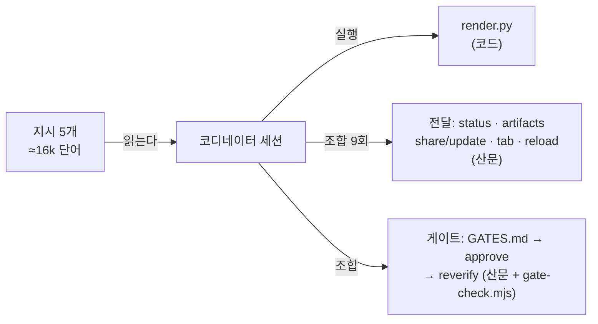
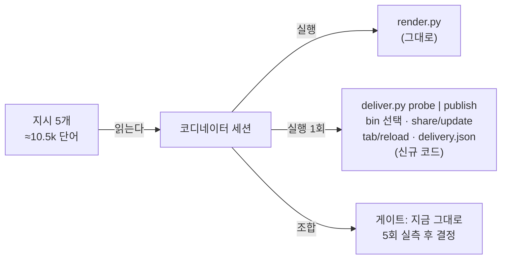

# 하네스 다이어트 — 산문을 코드로, 나머지는 줄인다

- 날짜: 2026-09-04
- 대상: weed-harness 3.0.0 → 3.1.0 (matt-loop 1.13.0, auto-loop 2.2.0)
- 설계 페이지: https://claude.ai/code/artifact/de8bbd24-b5f6-45dc-993d-ed6eadff21a6

## 목표

공통 런타임(loop-report · model-routing · loop-gates)의 구조는 그대로 두고, 그 안의 무게를 산문에서 코드로 옮긴다. 구체적으로:

1. 전달(probe / publish)을 스크립트 `deliver.py` 하나로 닫아 LLM이 Orca 명령을 매번 조합하지 않게 한다.
2. 한 번의 matt-auto 실행이 읽는 지시를 약 16,400단어에서 약 10,500단어(문서별 목표의 합, 36% 감소)로 줄인다. 규칙 수는 유지하고 문장 수만 줄인다.
3. unlazy 게이트는 없애지도 늘리지도 않고, 다음 5회 실행에서 잡은 결함 수를 기록해 결정을 미룬다.

## 비목표

- 루프 그래프(인터뷰 게이트, 결정 위임자, 가설 프론티어)는 건드리지 않는다.
- 기능 추가 없음. OpenCode 지원은 유지한다(사용 중 확인).
- 게이트 제거 또는 스크립트화는 이번 범위 밖이다(D6).

## 현재 구조와 문제



코드로 닫힌 갈래는 render.py 하나다. 어제까지의 사고(perl 스플라이스, reload 누락, 워커 오남용)는 전부 산문 갈래에서 났다.

## 확정 구조



### deliver.py 인터페이스 (D1, D2)

위치: `skills/loop-report/assets/deliver.py`. 의존성 없음(Python 3 표준 라이브러리). 호출 스킬은 두 동사만 안다.

```
python3 <loop-report>/assets/deliver.py probe   --page <dir>/<slug>.html    # 페이지가 아직 없어도 된다
python3 <loop-report>/assets/deliver.py publish --page <dir>/<slug>.html [--rerun-share]
python3 <loop-report>/assets/deliver.py show    --page <dir>/<slug>.html    # 상태만 출력, 부작용 없음
```

- 출력은 항상 stdout 한 줄 JSON: `{"route": "link|tab|path", "url": ..., "browserPageId": ..., "bin": "orca|orca-ide", "reason": "<한 줄, route가 link가 아닐 때>", "page": "<절대 경로>"}`. 종료 코드는 0(답함) / 1(publish에 없는 페이지를 준 경우 등 호출 오류). 경로가 `path`여도 0이다. 경로가 없는 것은 오류가 아니라 답이다. probe는 페이지가 아직 렌더링되기 전에 돌 수 있어야 하므로 파일 존재를 요구하지 않는다. `show`는 상태 조회 전용이라 `/autocode status`처럼 발행 답을 기억하지 못하는 새 컨텍스트가 쓴다.
- 상태는 `<dir>/<slug>.delivery.json`에만 두고 스크립트만 읽고 쓴다(`route`, `bin`, `url`, `browserPageId`, `denied`, `reason`, `told`). 호출 스킬은 이 파일을 열지 않고 `show`로 묻는다.
- 실행 파일 선택: Orca 터미널 안(`ORCA_*` 환경변수 존재)에서는 `orca`를 먼저 시도하고 `bad option: --no-sandbox`가 나오면 `orca-ide`로 바꾼다. Orca 터미널 밖 Linux 셸에서는 `orca-ide`만 시도한다. 그 환경의 bare `orca`는 GNOME 스크린 리더라 실행하면 사용자 머신에서 음성이 켜지므로 절대 부르지 않는다. 선택 결과는 delivery.json의 `bin`에 기록하고 이후 호출은 그것만 쓴다.
- probe: `status --json`, `artifacts list --json`을 실행해 `link` / `tab`(authentication_required) / `path`(CLI 없음 · 런타임 없음)를 판정한다. `artifact_sharing_disabled`는 share에서만 드러나므로 `link`는 잠정 값이다.
- publish 순서: (1) delivery.json을 읽는다. (2) route가 `link`이거나 미정이면 `artifacts update`, 기록이 없으면(`artifact_not_found` 류) `artifacts share`. 거부(`artifact_sharing_disabled`, `authentication_required`)되면 `denied`에 사유를 적고 `tab`으로 내려간다. 거부는 `--rerun-share`가 있을 때만 다시 시도한다. (3) route가 `tab`이면 `tab list`로 같은 `file://` URL의 탭을 찾아 `browserPageId`를 재사용하고, 없으면 `tab create`, 있으면 `reload --page`. `browser_tab_not_found`면 다시 만든다. (4) 어느 것도 안 되면 `path`.
- 실패 구분: 거부(denial)와 기록 없음(not found)과 일시 실패(timeout, 800KB 초과, 런타임 blip)를 구분한다. 일시 실패는 경로를 바꾸지 않고 기존 링크를 유지한 채 `reason`에 "update 실패, 이전 버전이 보이는 중"이라고 답한다. 두 번째 URL을 만들거나 tab으로 영구 강등하지 않는다. 스크립트가 예외로 죽지 않는다.
- 사람에게 전할 말: 거부 사유의 긴 설명(Settings › Artifacts 경로, 헤드리스 런타임에서는 탭이 최종이라는 것)은 처음 한 번만 `reason`에 싣고 이후에는 짧은 태그만 싣는다(`told` 키). 링크 인계 시 "새로고침 전에 내보내기", 800KB 상한, 30일 만료는 loop-report SKILL.md의 사용법 절이 한 문장씩 갖는다.
- 테스트: `skills/loop-report/tests/test_deliver.py`(unittest)가 같은 폴더의 가짜 `orca-ide` 스텁을 격리된 `PATH`에 두고 probe 3경로, 페이지 렌더 전 probe, publish 연속(같은 URL·같은 browserPageId 재사용), 거부 후 tab 전환과 재시도 금지, `--rerun-share`, 일시 실패 시 링크 유지, 탭 소실 시 재생성, show를 검증한다. `npm test`(package.json)와 `.github/workflows/test.yml`이 매 push마다 돌린다. 설치기는 스킬을 복사할 때 `tests/`를 제외한다.

### 버전 의존 (D8 보완)

matt-loop 1.13.0과 auto-loop 2.2.0은 `deliver.py`를 실행하므로 weed-harness **≥ 3.1**이 필요하다. marketplace 설명을 "Requires weed-harness 3.1+"로 올리고, 두 루프는 스크립트가 없으면 `weed-harness 3.1 required: deliver.py missing`을 한 번 말하고 렌더된 경로를 넘긴다(전달 폴백은 경로).

### 문서 다이어트 (D3, D7)

| 문서 | 지금 | 목표 | 방법 |
|---|---|---|---|
| loop-report SKILL.md | 2,974단어 | ≤ 2,000 | 전달 절 1,173단어 → deliver.py 사용법 200단어. 명령 이름(`artifacts share`, `tab create`, `reload`)이 SKILL.md에 남지 않는다 |
| matt-auto SKILL.md | 8,469단어, red flag 24 | ≤ 4,500, red flag ≤ 10 | 같은 규칙이 두 번 나오는 곳(진행 보드 · Live board · Final report · Parallel execution)을 절차 하나로 합친다. Orca 루프의 단계별 서술은 유지하되 반복 설명을 지운다. 규칙은 하나도 빼지 않는다 |
| interview-report SKILL.md | 2,661단어 | ≤ 1,800 | 데이터 스키마와 왕복만 남긴다. 전달 문장은 전부 지운다 |
| autocode SKILL.md | 634줄 | 스키마·예시·템플릿을 전부 옮긴 뒤의 값(약 430줄 예상) | JSON 예시, 3I 데이터 절, 템플릿을 `assets/reference.md`로 옮기고 SKILL.md는 절차만. 코디네이터는 데이터를 쓸 때 reference.md를 읽는다(토큰이 이동하는 것이지 사라지는 것은 아니다). 절차를 잘라 줄 수를 맞추지 않는다. validate.py가 snake_case 키 유출을 거부해 reference.md를 건너뛴 코디네이터의 빈 보드를 막는다 |
| model-routing · loop-gates | 1,248 · 1,006 | 그대로 | 이미 짧다 |

"규칙 수 유지"의 검증: 다이어트 전 red flag와 절차 항목을 목록으로 뽑아 두고, 후 문서에 각 항목이 어디에 남았는지 대조표를 커밋 메시지에 남긴다.

### 작은 일 안내 (D4)

matt-auto description 첫 문장에 손익분기점을 적는다: "한 파일 · 30분 이하의 변경이면 이 스킬 대신 `$implement`를 직접 부른다. 인터뷰 · 게이트 · 리뷰 · 보고서는 티켓 여러 개짜리 작업에서만 남는 장사다." 새 플래그는 만들지 않는다.

### 게이트 실측 (D6)

matt-auto 결정 로그 끝과 autocode 최종 요약·마지막 lesson 파일에 `gates_caught: <n>`을 남긴다. 값은 코디네이터의 `--reverify`에서 UNMET으로 돌아온 게이트 수다(autocode는 재시도 루프가 없으므로 "재시도로 고쳐진 건수"로 정의하면 항상 0이 된다). 5회 누적 후 0이면 티켓 원장을 선택 사항으로 강등하는 별도 결정을 연다.

## 결정 목록

| # | 결정 | 이유 |
|---|---|---|
| D1 | 전달을 `deliver.py`로 스크립트화 | 9개 명령과 delivery.json 편집은 결정적 절차다. 사고 3건 중 2건이 이 갈래였다 |
| D2 | 두 동사(probe/publish), 한 줄 JSON 출력, 상태는 스크립트만 소유 | 호출 스킬이 상태를 기억할 필요가 없어야 한다 |
| D3 | matt-auto ≤ 4,500단어, red flag ≤ 10, 규칙 수 유지 | 반복 설명을 없애는 것이지 규칙을 빼는 것이 아니다 |
| D4 | 작은 일은 description 첫 줄 안내, 플래그 없음 | 플래그는 또 하나의 경로다 |
| D5 | OpenCode 지원 유지 | 사용 중임을 확인했다 |
| D6 | 게이트는 5회 실측 후 결정 | 게이트가 결함을 잡은 기록이 아직 없다. 없애기 전에 세어 본다 |
| D7 | autocode JSON 예시를 `assets/reference.md`로 분리 | 매 실행이 읽을 필요가 없다 |
| D8 | weed-harness 3.1.0 (minor) | 호출 스킬 인터페이스는 같다 |

## 구현 순서

1. `deliver.py` + `tests/test_deliver.py` 작성 → 확인: 가짜 orca-ide 스텁으로 unittest 전부 통과. probe 3경로, publish 연속 2회에 같은 browserPageId, 거부 후 tab 전환.
2. loop-report SKILL.md 전달 절 교체 → 확인: `wc -w` ≤ 2,000, `grep -c "artifacts share\|tab create\|reload --page"` = 0.
3. matt-auto SKILL.md 다이어트 → 확인: `wc -w` ≤ 4,600, red flag ≤ 10, 다이어트 전 규칙 목록(102항목)의 각 항목이 새 문서에 남아 있는지 자동 대조(키워드 기준)가 통과하고 대조표가 커밋 메시지에 있음, vn 토이 레포 small path 회귀 통과(탭 경로, `deliver.py publish` 호출만 보이고 `orca-ide` 직접 호출 0회).
4. interview-report 다이어트, autocode reference.md 분리 → 확인: interview-report ≤ 1,800단어, autocode SKILL.md에 남은 fenced JSON 0개, vn autocode 회귀 통과(보드 갱신이 deliver.py 경유).
5. matt-auto description 첫 줄 안내 → 확인: description에 `$implement` 안내 문장이 있고 YAML 파싱이 통과한다.
6. 게이트 실측 항목 → 확인: matt-auto SKILL.md의 결정 로그 절과 autocode 3F에 `gates_caught` 정의(UNMET 건수)가 있고, vn 회귀 실행의 로그에 그 줄이 실제로 찍힌다.
7. 3.1.0 릴리스 · 배포 → 확인: vn · home_pc · 노트북 · data_converter 버전 확인, Codex 재시작 안내.
