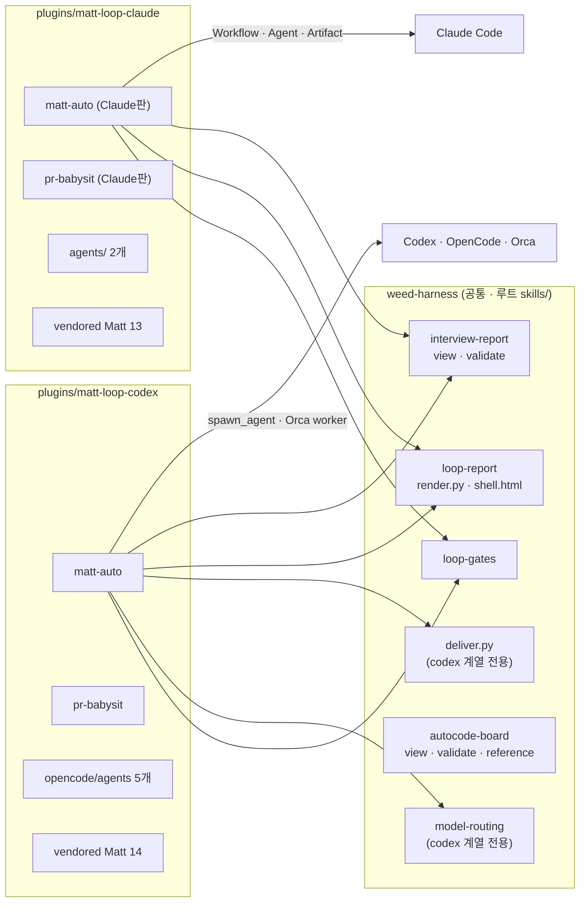
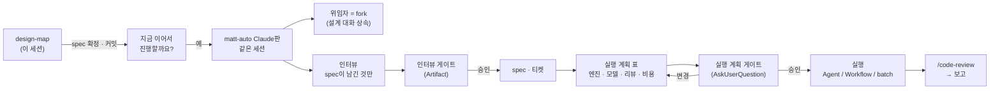

# 하네스 플랫폼 분리 — Claude용 루트와 Codex용 루트

- 날짜: 2026-09-06
- 대상: weed-harness 4.0.0 → 5.0.0, matt-loop 2.0.0 → 3.0.0, auto-loop 3.0.0 → 4.0.0
- 선행: `feat/harness-diet-b`(diet-b 구현, 커밋 `1ba93fd`까지) + 같은 브랜치의 미커밋 WIP(harness-diet-b spec의 추가 결정 D10–D16 — 이 spec의 D-id와 무관 — 와 에이전트 무인 문구 · HUD · settings)를 먼저 커밋한다(D13).
- 설계 페이지: https://claude.ai/code/artifact/dc7621c0-5202-40e3-8e69-b8aef47359fc

## 큰 틀

두 루프 플러그인(matt-loop · auto-loop)을 Claude Code용 루트(`plugins/*-claude`)와 Codex · OpenCode · Orca용 루트(`plugins/*-codex`)로 나눈다. marketplace의 플러그인 이름은 `matt-loop` · `auto-loop` 그대로 두고 source 경로만 플랫폼별로 갈라지며, `bin/install.mjs`는 플랫폼에 따라 어느 루트를 복사할지 정한다. 플랫폼과 무관한 자산 — interview-report(view · validate)와 autocode의 view · validate · reference — 는 weed-harness 루트 `skills/`로 승격하고(`skills/interview-report`, `skills/autocode-board`), vendored Matt 스킬은 sync 스크립트가 두 루트에 같이 쓴다(Claude 루트는 code-review 제외). `agents/`는 Claude 루트에만, `opencode/`는 Codex 루트에만 둔다. model-routing 표와 deliver.py는 루트에 남되 "Codex · OpenCode · Orca 전용"이 되고, Claude판은 그 둘을 읽지 않는다.

Claude판은 **내장 우선**이다. 구현 loop에서 내장이 대신하는 것은 기계(디스패치 · 워크트리 · 대기 · 전달)이고, 하네스는 내장에 없다고 확인된 것만 든다: 인터뷰 게이트 페이지와 결정 그래프, 코디네이터의 검증 정책(검증 명령 직접 실행 · 재시도 ≤ 2 · 머지 뒤 재검증 · 보드 갱신), ship 원장과 merge 금지, pr-babysit, resolving-merge-conflicts. 내장 매핑: 결정 위임자 = Agent fork(세션이 Fable 계열일 때; 아니면 `matt-deep` 에이전트 + 브리프), 직렬 티켓 = Agent `matt-default` / `matt-deep`, 병렬 웨이브 = Workflow pipeline(`agentType`, `isolation: 'worktree'`, `schema`) 또는 ship 모드 · 독립 티켓 · 티켓마다 PR일 때 `/batch`, 리뷰 = `/code-review`(level은 게이트에서, ultra는 사용자가 고를 때만) + `/simplify`(기본) + `/security-review`(auth · 데이터 · 외부 인터페이스 티켓), 조사 우회 = `/deep-research`, 계획 제안(design-map 없이 시작한 small path) = `/plan` 모드, babysit 주기 = `/loop`(세션을 닫아야 하면 `/schedule`), 페이지 전달 = Artifact 도구(같은 파일 재발행 = 같은 URL). `/ultraplan`은 문서가 없어 보류한다.

Claude판에는 게이트가 둘이다. 인터뷰 게이트(설계가 맞나)는 그대로이고, 티켓이 나온 직후 **실행 계획 게이트**(이 돈과 이 도구로 해도 되나)가 `--confirm`과 무관하게 항상 열린다: 웨이브 · 티켓 · 엔진(Agent 직렬 / Workflow와 ultracode 여부 / `/batch`) · 모델·effort · 에이전트 수 · 리뷰 level(ultra 여부) · 추가 패스(`/simplify` · `/security-review`) · 실행 세션(이 세션 / `/fork`) · 대략 비용 · 이유 · 코디네이터 모델과 위임자 경로를 표로 제시하고 AskUserQuestion으로 승인받는다. 크기에 따라 게이트는 줄어든다 — 한 파일 · 30분 이하는 "지금 구현할까요?" 한 질문에 엔진 한 줄, small path는 한 행짜리 계획을 "이어서 진행할까요?"와 한 번에, 그 이상은 두 게이트 전부. design-map 뒤 Claude에서 이어갈 때는 같은 세션이 그대로 matt-auto가 된다(`/fork` 배경 세션은 선택지): Claude판 matt-auto에는 `disable-model-invocation`을 두지 않고, 위임자 fork가 설계 대화를 물려받으며, 인터뷰는 spec이 남긴 질문만 한다. 루프 그래프(인터뷰 게이트 · 결정 위임자 · 가설 프론티어 · 직렬 측정 · squash-keep → PR)는 두 판이 같다.

## 목표

1. `plugins/matt-loop-claude` · `plugins/matt-loop-codex` · `plugins/auto-loop-claude` · `plugins/auto-loop-codex` 네 루트가 있고, `.claude-plugin/plugin.json`은 `-claude` 루트에만, `.codex-plugin/plugin.json`은 `-codex` 루트에만 있다. `.claude-plugin/marketplace.json`은 `-claude` 경로를, `.agents/plugins/marketplace.json`은 `-codex` 경로를 가리키며 플러그인 이름은 `matt-loop` · `auto-loop` 그대로다.
2. `skills/interview-report`(view.html · validate.py · SKILL.md)와 `skills/autocode-board`(view.html · validate.py · reference.md · SKILL.md)가 weed-harness 루트에 있고, 두 판의 matt-auto · autocode가 그것을 참조한다. 플러그인 루트 안에 이 파일들의 복제본이 없다.
3. Claude판 SKILL.md(matt-auto · pr-babysit · resolving-merge-conflicts · autocode)에 `deliver.py` · `model-routing` · `orca orchestration` · `spawn_agent` 문자열이 0회다. Claude판 matt-auto는 실행 계획 게이트(열 10개)와 크기별 세 갈래(implement / small path / 전체)를 정의하고 `disable-model-invocation`이 없다. Codex판 SKILL.md는 diet-b 결과에서 파일 위치만 바뀐다(diff는 경로뿐).
4. `agents/`(matt-default · matt-deep · experimenter-default · experimenter-deep · strategist)는 `-claude` 루트에만, `opencode/agents`(5개)와 `opencode/commands`는 `-codex` 루트에만 있다. `sync-upstream.sh`는 두 루트에 vendored 스킬을 쓰고 Claude 루트에서 `code-review`를 뺀다. `mattpocock.lock.json`은 하나다.
5. `bin/install.mjs`: `claude-code` → `*-claude/skills`, `codex` · `opencode` · `gemini-cli` · `orca` → `*-codex/skills`(+ opencode agents/commands). `bin/check-versions.mjs`는 네 루트와 두 marketplace를 검사하고, `bin/check-words.mjs`는 Codex판 상한(3,800 / 4,250 / 8,700)을 유지하며 Claude판은 실측 뒤 상한을 추가한다.
6. `skills/loop-report/SKILL.md` 전달 절이 "Claude Code → Artifact 도구 재발행 / 그 외 → deliver.py"로 갈라지고, `skills/model-routing/SKILL.md` description에 "Codex · OpenCode · Orca 전용"이 있다. `skills/design-map/SKILL.md` 7단계에 Claude 분기("지금 이어서 진행할까요?" → 이 세션 / `/fork` → 같은 세션에서 Claude판 matt-auto)가 있고 Codex 분기는 그대로다.
7. 버전: weed-harness 5.0.0 · matt-loop 3.0.0 · auto-loop 4.0.0, marketplace 설명은 "Requires weed-harness 5.0+".

## 비목표

- Codex판의 규칙과 문장은 바꾸지 않는다(diet-b 결과 그대로, 위치만). 루프 그래프도 바꾸지 않는다.
- OpenCode · Orca 지원을 줄이지 않는다. `deliver.py` · `render.py` · `validate.py` · `gate-check.mjs`의 호출 방식을 바꾸지 않는다.
- `/ultraplan`은 넣지 않는다(D21). `/batch`의 내부 동작(에이전트 수 · PR 형식)을 바꾸거나 감싸지 않는다.
- Claude판의 단어 상한은 이 spec에서 정하지 않는다(실측 뒤).
- `docs/design/` 아래 날짜 붙은 설계 문서와 `harness-diet-inventory/`는 이력이라 고치지 않는다.

## 확정 구조

## 결정

| id | 질문 | 선택 | 이유 |
|---|---|---|---|
| D1 | 분리 단위는? | A 플러그인 루트 분리 — `plugins/matt-loop-claude` · `matt-loop-codex` · `auto-loop-claude` · `auto-loop-codex` | 매니페스트가 이미 플랫폼별이라 루트를 나누면 각 매니페스트가 자기 루트만 가리킨다 |
| D2 | marketplace의 플러그인 이름은? | 이름 유지, source 경로만 분기 | `/plugin install matt-loop@weed-plugins`와 `codex plugin add matt-loop@weed-plugins`가 그대로 동작한다 |
| D3 | 플랫폼 중립 자산은 어디에? | weed-harness 루트로 승격 — `skills/interview-report`, `skills/autocode-board` | 페이지 데이터 계약은 플랫폼과 무관하고 loop-report와 같은 층이다. 복제는 드리프트, 심볼릭 링크는 Windows · zip에서 깨진다 |
| D4 | vendored Matt 스킬은? | 두 루트에 sync, Claude 루트는 code-review 제외 | Claude판도 단계는 Matt 스킬이다. 업스트림 복사본이라 복제 비용이 없고 매일 밤 sync가 양쪽을 맞춘다 |
| D5 | model-routing 표는? | 루트 유지, "Codex · OpenCode · Orca 전용" 표시. Claude판은 SKILL.md 안 두 행(Default opus/medium · Deep fable/high)과 agents/ 파일로 라우팅 | Claude Code는 에이전트 파일이 모델과 effort를 고정하므로 표가 필요 없다 |
| D6 | loop-report의 전달은? | 루트 유지, SKILL.md 전달 절이 "Claude Code → Artifact 도구 / 그 외 → deliver.py"로 갈라진다 | deliver.py를 플러그인으로 옮기면 두 codex 플러그인에 복제된다 |
| D7 | Claude판 병렬 웨이브 엔진은? | 기본은 Workflow pipeline(`agentType`, `isolation: 'worktree'`, `schema`); ship 모드 · 독립 티켓 · 티켓마다 PR이면 `/batch`. 승인은 실행 계획 게이트에서 | Workflow는 제어흐름이 코드로 고정되고 구조화 결과와 resume이 있다. `/batch`는 결과가 PR 단위라 ship 모드에 맞다 |
| D8 | Claude판 결정 위임자는? | Agent fork(대화 상속). 티켓 구현 · 충돌 해결은 matt-default / matt-deep | 위임자의 가치는 큰 틀을 아는 것이고 fork가 요약 없이 넘긴다 |
| D9 | 리뷰 패스와 babysit 주기는? | `/code-review`(baseline..HEAD)와 `/loop` | 내장이 있고 지시문 비용이 0이다. ultra는 model-routing의 ultra 금지와 별개(리뷰이지 워커가 아님) |
| D10 | 설치기와 marketplace 매핑은? | install.mjs: claude-code → `*-claude`, 나머지 → `*-codex`; Claude marketplace는 `-claude` 경로, Codex marketplace는 `-codex` 경로 | 사용자는 여전히 플러그인 이름만 고른다 |
| D11 | agents/ 와 opencode/ 는? | agents/ → `-claude` 루트만, opencode/ → `-codex` 루트만 | 서로 읽지 않는 파일을 같은 루트에 둘 이유가 없다 |
| D12 | 버전은? | weed-harness 5.0.0 · matt-loop 3.0.0 · auto-loop 4.0.0 | source 경로와 스킬 위치가 바뀌어 옛 설치와 호환되지 않는다 |
| D13 | diet-b의 미커밋 WIP는? | 이 설계 전에 별도 커밋(`feat(harness): diet-b addendum D10–D16`) | Claude판 에이전트 파일이 무인 문구를 물려받아야 하고 baseline이 깨끗해야 한다 |
| D14 | 엔진 · 모델 · ultracode는 누가 정하나? | 실행 계획 게이트 — 코디네이터가 표(엔진 열에 Workflow의 ultracode 여부, 리뷰 열에 ultra 여부)를 만들고 사용자가 AskUserQuestion으로 승인. `--confirm` 없이도 항상 | 내장 도구는 스킬 지시만으로 실행되므로 지출 결정은 사용자가 한다 |
| D15 | design-map 뒤 Claude 인계는? | 같은 세션이 그대로 진행. Claude판은 `disable-model-invocation` 없음 | Claude는 같은 세션이라 명령 붙여넣기가 문맥을 버린다 |
| D16 | `/batch`는? | 쓴다. 조건: ship 모드 + 독립 티켓 + 티켓마다 PR. 그 밖은 Workflow | `/batch`의 산출물은 PR n개라 기본의 "한 브랜치 → PR 하나"와 다르다 |
| D17 | 구현이 작을 때는? | 세 갈래: 한 파일 · 30분 이하는 "지금 구현할까요?" + 엔진 한 줄, small path는 한 행짜리 계획을 "이어서 진행할까요?"와 한 번에, 그 이상은 전체 | 게이트는 남기되 질문 수는 크기만큼만 |
| D18 | 세션이 Opus 5 등 비-Fable일 때는? | Fable 계열이면 fork, 아니면 matt-deep + 브리프. 티켓 라우팅은 에이전트 파일대로. 실행 계획 표에 코디네이터 모델 · 위임자 경로 표시 | fork는 부모 모델을 물려받아 설계 결정이 Deep 아래로 내려간다 |
| D19 | Workflow의 agent()는? | `agentType: 'matt-loop:matt-default' \| 'matt-deep'` + `schema`(branch · worktree · commits). 플러그인 에이전트가 없으면 `model` / `effort` 옵션으로 같은 페어, 폴백 기록. 동시 수는 `--parallel`(최대 4) | 기본 서브에이전트는 세션 모델을 상속한다 |
| D20 | Claude판의 원칙은? | 내장 우선. 하네스는 내장에 없는 것만 | 내장은 지시문 비용이 0이고 릴리스와 같이 움직인다 |
| D21 | `/ultraplan`은? | 보류 | 명령 · 출력 · 과금 문서가 없다 |
| D22 | 리뷰 · 정리 · 보안 내장은? | `/code-review` + `/simplify`(기본 켬) + `/security-review`(auth · 데이터 · 외부 인터페이스 티켓). `--fix`는 확인된 finding에만 | 정확성 · 품질 · 보안으로 역할이 겹치지 않는다 |
| D23 | 실행을 어느 세션에서? | "이어서 진행할까요?"에 이 세션(기본) / `/fork` 배경 세션 | 긴 실행 중에도 사용자가 다른 일을 할 수 있다 |
| D24 | 조사 · 프로토타입 우회는? | 외부 출처는 `/deep-research`, 실행 답은 `$prototype`, design-map 없는 small path의 계획은 `/plan` 모드 | 둘 다 하네스 문장을 줄인다 |

## 구현 순서

1. diet-b WIP 커밋(D13): 워크트리의 미커밋 변경 10개 파일(이 spec 제외)을 `feat(harness): diet-b addendum D10–D16`로 → 확인: `git status --porcelain`에 이 spec 파일만 남는다; `npm test` 통과.
2. 루트 승격(D3): `git mv plugins/matt-loop/skills/interview-report skills/interview-report`; `plugins/auto-loop/skills/autocode/assets/{view.html,validate.py,reference.md}` → `skills/autocode-board/assets/` + 새 `SKILL.md`(데이터 계약과 render 호출만); autocode · matt-auto · loop-report의 `--view` 경로와 `assets/reference.md` 참조를 새 위치로 → 확인: `ls skills/interview-report/assets skills/autocode-board/assets`가 둘 다 있다; `grep -rln "matt-loop/skills/interview-report\|autocode/assets" plugins skills`가 0건; `npm test` 통과.
3. Codex 루트(D1 · D11): `git mv plugins/matt-loop plugins/matt-loop-codex`, `git mv plugins/auto-loop plugins/auto-loop-codex`; 두 루트에서 `.claude-plugin/`과 `agents/` 삭제 → 확인: `ls plugins/*-codex/.claude-plugin plugins/*-codex/agents`가 없다; `plugins/matt-loop-codex/.codex-plugin/plugin.json`의 `skills`가 `./skills/`다.
4. Claude 루트(D1 · D4 · D11): `plugins/matt-loop-claude/{.claude-plugin/plugin.json, agents/(matt-default · matt-deep), skills/}`, `plugins/auto-loop-claude/{.claude-plugin/plugin.json, agents/(experimenter-default · experimenter-deep · strategist), skills/autocode}`; `.codex-plugin`은 두지 않는다; `sync-upstream.sh`의 `DEST`를 두 루트 배열로 하고 Claude 루트는 `code-review` 제외 → 확인: `bash plugins/matt-loop-codex/scripts/sync-upstream.sh <local upstream>` 뒤 두 루트의 vendored 목록이 lock과 일치(Claude 13, Codex 14); `node bin/check-versions.mjs`가 네 루트를 읽는다(7단계 뒤).
5. Claude판 SKILL.md(D5 · D7 · D8 · D14–D24): `matt-loop-claude/skills/matt-auto/SKILL.md` — Codex판에서 Orca 워커 절 · deliver.py · model-routing 참조를 빼고, 위임자 fork/matt-deep 규칙(D18), 실행 계획 게이트(열 10개, D14), 크기별 세 갈래(D17), Workflow pipeline + `/batch` 조건(D7 · D16 · D19), 리뷰 `/code-review` + `/simplify` + `/security-review`(D22), `/deep-research` · `/plan` 우회(D24), Artifact 전달, `disable-model-invocation` 없음(D15); `pr-babysit` — `/loop` 주기 · `/schedule` 옵션; `resolving-merge-conflicts` — Claude Code 라우팅 문단만; `auto-loop-claude/skills/autocode/SKILL.md` — Orca 배치 절 삭제, 3H를 agents/ 파일 세 개로, 보드 전달을 Artifact로 → 확인: 네 SKILL.md에 `deliver.py` · `model-routing` · `orca orchestration` · `spawn_agent` 문자열 0회; matt-auto Claude판 frontmatter에 `disable-model-invocation` 없음; "실행 계획" 표 열 10개(웨이브 · 티켓 · 엔진[Agent 직렬 / Workflow와 ultracode 여부 / /batch] · 모델·effort · 에이전트 수 · 리뷰 level[ultra 여부] · 추가 패스 · 실행 세션 · 비용 · 이유)가 정의되어 있다.
6. 공통 스킬(D5 · D6 · D15 · D23): `skills/loop-report/SKILL.md` 전달 절 분기; `skills/model-routing/SKILL.md` description에 "Codex · OpenCode · Orca 전용"; `skills/design-map/SKILL.md` 7단계에 Claude 분기(질문 한 번: 이 세션 / `/fork` / Codex / OpenCode / 명령만; Claude면 같은 세션에서 Claude판 matt-auto 시작, Codex · OpenCode 분기는 그대로) → 확인: `node bin/check-words.mjs` 통과(model-routing · loop-gates 상한 유지); design-map SKILL.md에 "/fork" 문자열이 있다.
7. 설치 · marketplace · 검사(D2 · D10 · D12): `.claude-plugin/marketplace.json` source를 `-claude` 경로로, `.agents/plugins/marketplace.json` path를 `-codex` 경로로, 이름은 유지; `bin/install.mjs`의 PLUGINS `src`를 플랫폼별 함수로(claude-code → `-claude`, 그 외 → `-codex`), OPENCODE_ASSETS 경로 갱신; `bin/check-versions.mjs`가 `plugins/*` 네 루트를 읽도록; `bin/check-words.mjs` 경로를 `matt-loop-codex` · `auto-loop-codex`로; 루트 `README.md` · `plugins/*/README.md` · `docs/SKILL_MAP.md` 갱신 → 확인: `node bin/install.mjs --dry-run --yes --no-unlazy --platforms claude-code --plugins matt-loop --home <tmp>` 출력에 `-claude` 경로만, `--platforms codex`에 `-codex` 경로만; `npm test` 통과.
8. 버전 범프(D12): manifest 6개(루트 2 + Claude 2 + Codex 2) · `package.json` · marketplace 2개 → 확인: `node bin/check-versions.mjs` 통과, 5.0.0 / 3.0.0 / 4.0.0, "Requires weed-harness 5.0+".
9. 회귀(사람, 릴리스 뒤): Claude Code에서 design-map → "이어서 진행할까요?" → matt-auto Claude판 small path 1회, 병렬 웨이브 1회(Workflow), ship 모드 `/batch` 1회; Codex에서 diet-b 12단계 그대로 → 확인: `/skill-doctor`에 Claude판 스킬만 나타나고 model-routing · loop-report 전달 절은 호출 0회; 실행 계획 게이트가 승인 전에 한 번 열린다; Claude판 SKILL.md 단어 수를 재서 `check-words.mjs`에 상한을 추가한다.
